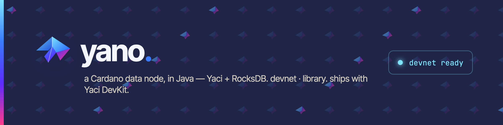

<p align="center">
  
</p>

<p align="center">
  <a href="LICENSE"></a>
  
  <a href="https://central.sonatype.com/namespace/com.bloxbean.cardano"></a>
  <a href=".github/workflows/build.yml"></a>
</p>

# Yano

**Yano** is a Cardano Data node implementation in Java, built on top of [Yaci](https://github.com/bloxbean/yaci)
(node-to-node / node-to-client mini protocols) and [Cardano Client Lib](https://github.com/bloxbean/cardano-client-lib).
Persistence is RocksDB. The node ships as a runnable Quarkus application **and** as a library you can embed.

> ⚠️ **Pre-release.** Yano is under active development. APIs and storage formats may still
> change between pre-releases. Use it for development networks, regression testing, ledger
> experimentation, and downstream prototyping — not yet for production validation.

---

## Where Yano fits

Yano's initial goal is to fill three roles:

- **A devnet node** that runs inside [Yaci DevKit](https://github.com/bloxbean/yaci-devkit)
  alongside the Haskell `cardano-node`, so teams can spin up a complete local
  Cardano network without managing a Haskell toolchain.
- **An embeddable library** that custom Java applications can depend on to drive a Cardano
  node in-process — for indexers, wallets, validation tooling, or research code.
- **A test-network library** for Java applications that need a real, block-producing
  Cardano network during integration tests, with deterministic block timing and a
  programmable past-time-travel mode for replaying history quickly.

## Highlights

- **Real ledger state** — UTxO, account state (stakes / delegations / rewards), epoch snapshots,
  Conway-era governance (DReps, proposals, votes, committee), with full rollback support.
- **Devnet block producer** — produce blocks from a configured genesis and serve them to
  downstream nodes (Haskell `cardano-node`, Dingo, your own indexer) via the n2n protocol on port 13337.
- **Past-time-travel mode** — start a fresh devnet "in the past", produce blocks deterministically
  from slot 0, then catch up to wall-clock; useful for replaying long histories quickly.
- **Native image** — supports a GraalVM native build for fast startup and small footprint.
- **Modular** — publishable libraries (`yano-core-api`, `yano-runtime`, `yano-ledger-state`, …)
  let downstream projects depend on just the slice they need.

---

## Quick start

### Requirements

- **JDK 25** (Temurin or Oracle GraalVM 25; GraalVM is required only for native image builds)
- Gradle 9.4.1 (use the bundled `./gradlew`)

### Build

```bash
./gradlew clean build              # all modules + tests
./gradlew :app:quarkusBuild        # produce app/build/yano.jar (Quarkus uber-jar)
```

### Run a preprod relay (default profile)

```bash
java -jar app/build/yano.jar
# REST API:        http://localhost:7070
# n2n peer port:   13337
# Health:          http://localhost:7070/q/health/ready
```

The default profile points at the public Cardano **preprod** network (protocol magic `1`,
upstream peer `localhost:30000` — adjust in `app/src/main/resources/application.yml` or via
system properties).

### Run a local devnet block producer

```bash
java -Dquarkus.profile=devnet -Dquarkus.http.port=7070 -jar app/build/yano.jar
```

Genesis files live under `app/config/network/devnet/`. Yano updates the `systemStart`
field automatically on each startup so a fresh chain begins at "now". Connect a downstream
Haskell node, Dingo, or your own client to `127.0.0.1:13337` to consume the blocks.

### Past-time-travel mode

```bash
java -Dquarkus.profile=devnet -Dquarkus.http.port=7070 \
  -Dyano.block-producer.past-time-travel-mode=true \
  -jar app/build/yano.jar
```

Block production is deferred until you call:

```bash
# Start the chain N epochs in the past (Yano produces sequential blocks from slot 0)
curl -X POST http://localhost:7070/api/v1/devnet/epochs/shift \
  -H 'Content-Type: application/json' -d '{"epochs": 4}'

# Once you have enough blocks, fast-forward to wall-clock and switch to live production
curl -X POST http://localhost:7070/api/v1/devnet/epochs/catch-up
```

---

## Use as a library

Yano publishes individual modules to Maven Central (release coming — until then SNAPSHOT
artifacts are available on Sonatype's snapshot repo).

Pick the latest version from
[Maven Central](https://central.sonatype.com/namespace/com.bloxbean.cardano)
(or, while pre-release, the
[Sonatype snapshots repo](https://central.sonatype.com/repository/maven-snapshots/com/bloxbean/cardano/)).

```gradle
repositories {
    mavenCentral()
    // While Yano is pre-release:
    maven { url 'https://central.sonatype.com/repository/maven-snapshots/' }
}

ext {
    yanoVersion = '<latest>'  // see Maven Central link above
}

dependencies {
    implementation "com.bloxbean.cardano:yano-runtime:$yanoVersion"
    // or pull a slim slice:
    implementation "com.bloxbean.cardano:yano-core-api:$yanoVersion"
    implementation "com.bloxbean.cardano:yano-ledger-state:$yanoVersion"
}
```

### Published modules

| Coordinate | What it is |
|---|---|
| `com.bloxbean.cardano:yano-core-api` | Public node interfaces and plugin SPI |
| `com.bloxbean.cardano:yano-runtime` | Node implementation with RocksDB persistence |
| `com.bloxbean.cardano:yano-ledger-state` | Account / delegation / governance state stores |
| `com.bloxbean.cardano:yano-ledger-rules` | Validation rule interfaces |
| `com.bloxbean.cardano:yano-scalus-bridge` | Scalus-based Plutus script evaluation adapter |
| `com.bloxbean.cardano:yano-bootstrap-providers` | Initial-state providers (Blockfrost / Koios / …) |

The Quarkus REST application (`com.bloxbean.cardano.yano.app`, the `app/` module) is **not**
published; it's distributed as an uber-jar (`app/build/yano.jar`) and as a GraalVM native
binary (`app/build/yano`).

---

## Native image (GraalVM)

```bash
# JAVA_HOME must point at GraalVM Java 25
./gradlew :app:build -Dquarkus.profile=native
./app/build/yano -Dquarkus.profile=devnet -Dquarkus.http.port=7070
```

A distributable zip (`yano-native-<version>-<platform>.zip`) is produced under
`app/build/distributions/`.

---

## Project layout

```
yano/
├── core-api/            # Public node interfaces + plugin SPI
├── plugin-catalog/      # Manifest validation + JVM-only yano-plugins CLI
├── runtime/             # Main node implementation (RocksDB-backed)
├── ledger-state/        # Account / delegation / governance state stores
├── ledger-rules/        # Validation rule interfaces
├── scalus-bridge/       # Scalus Plutus script-eval adapter (Scala + Java)
├── bootstrap-providers/ # Initial-state providers
├── app/                 # Quarkus REST application + devnet block producer
└── adr/                 # Architecture decision records
```

---

## Documentation

For deeper coverage of how to operate and extend Yano, see the application-level docs:

| Doc | What's inside |
|---|---|
| **[`docs/APP_CHAIN_OVERVIEW.md`](docs/APP_CHAIN_OVERVIEW.md)** | Diagram-led 10–15 minute overview of Yano App Chains: value proposition, end-to-end flow, no-code presets, effects, composite state machines, plugins, use cases, trust boundaries, and readiness. |
| **[`docs/YANO_APP_CHAIN_OVERVIEW.pptx`](docs/YANO_APP_CHAIN_OVERVIEW.pptx)** | Editable 13-slide companion deck for a concise Yano App Chain architecture and product pitch. |
| **[`app/README.md`](app/README.md)** | Operator's guide — run modes (relay, devnet, native), `start.sh` / `start-devnet.sh`, configuration knobs, REST API reference, profiles, Swagger UI, integration with [yaci-store](https://github.com/bloxbean/yaci-store), and the test tiers (unit / integration / e2e). |
| **[`app/ARCHITECTURE.md`](app/ARCHITECTURE.md)** | Internal architecture — high-level topology, header/body split sync pipeline, event system, plugin system, module overview, REST API surface, configuration modes, and extension points. |
| **[`docs/PLUGIN_OPERATIONS.md`](docs/PLUGIN_OPERATIONS.md)** | Plugin catalog validation, operations API authentication, health/metrics exposure, dashboard behavior, and JVM/native deployment notes. |

Architecture decision records covering specific design choices live under
[`adr/`](adr/) — notably `adr/ledger-state/` for the state-store implementation
and `adr/014-slot-leader-selection-block-production.md` for block production.

---

## Related projects

- **[Yaci](https://github.com/bloxbean/yaci)** — Cardano protocol library Yano is built on
- **[Yaci DevKit](https://github.com/bloxbean/yaci-devkit)** — local Cardano dev environment
  (Yano is the underlying node)
- **[Cardano Client Lib](https://github.com/bloxbean/cardano-client-lib)** — transaction
  building, address handling, crypto

---

## License

[MIT](LICENSE)
