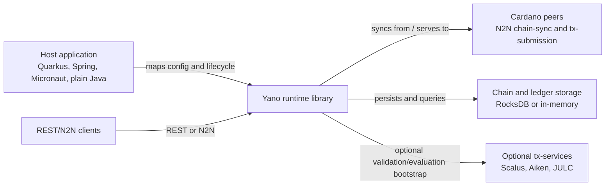
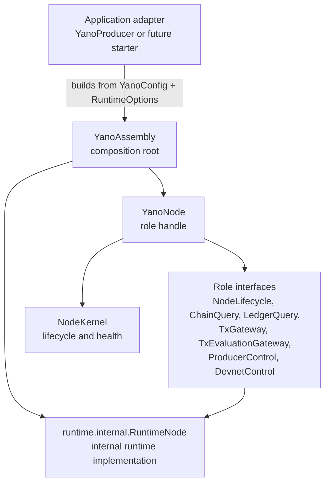
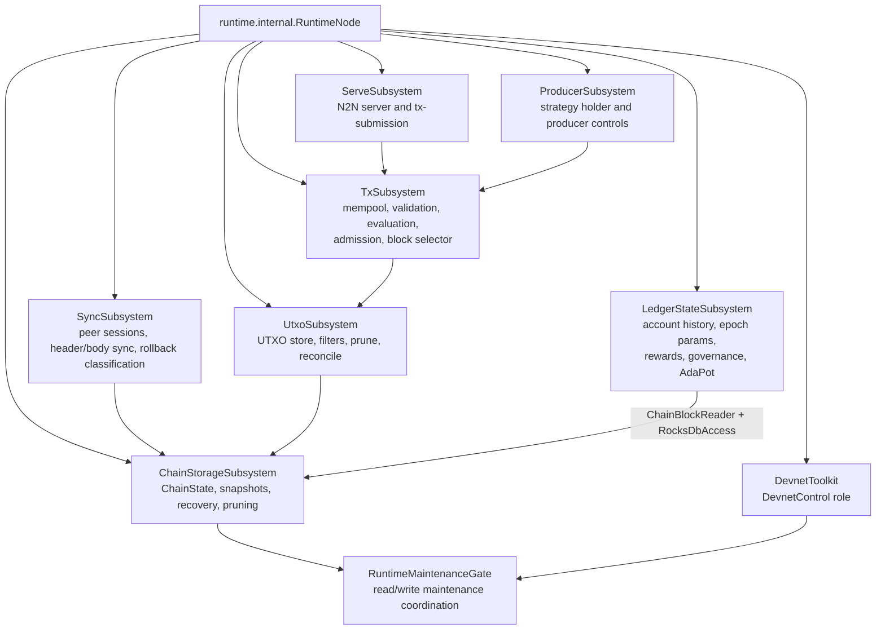
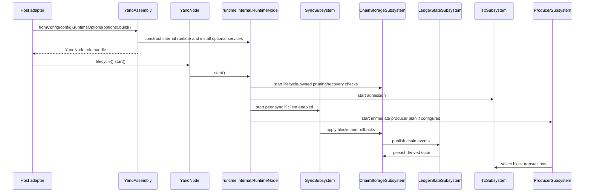
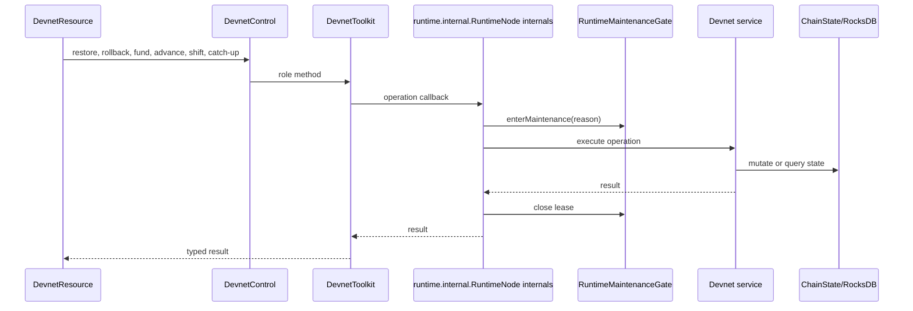

# ADR-028 High-Level Runtime Design

This document summarizes the post-ADR-028 runtime shape after the pre-release API
cleanup. Public construction goes through `YanoAssembly`; consumers use
`YanoNode` and narrow role interfaces. The old `Yano` and `NodeAPI` public
surfaces are removed.

## C4 Context

## Container View

## Runtime Component View

## End-To-End Flow

## Devnet Control Flow

## API Boundary Rules

- Embedders construct with `YanoAssembly` and hold `YanoNode`.
- App adapters expose only the role beans they need.
- `NodeAPI`, direct public `Yano` construction, and raw mempool access are gone.
- `ChainQuery` exposes tip/block reads and does not leak the raw `ChainState`
  object to adapters or REST resources.
- Account-state providers receive `ChainBlockReader` for replay/reconciliation
  and explicit `RocksDbAccess` only for RocksDB-backed stores; they do not depend
  on `DirectRocksDBChainState` or mutable `ChainState`.
- `DevnetControl` is backed by `devnet-toolkit` through ADR-029. Runtime
  devnet recipes expose devnet-safe SPI ports but not the optional control
  adapter; plain slot-leader recipes expose producer controls only.
- Runtime writes that move chain, producer, or devnet state go through
  `RuntimeMaintenanceGate`; normal reads use role interfaces.
