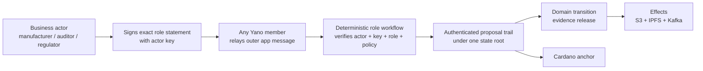
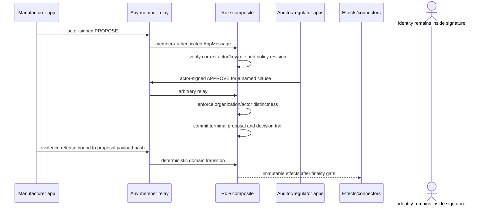

# Domain Actors and Role-Aware Approvals

This guide explains how Yano proves which business actors authorized exact
application bytes without making every auditor, regulator, employee, service,
or device a consensus node. It covers the ADR-019 stock implementation,
operations, signing, recovery, proofs, and plugin reuse.

## 1. The idea in one picture



The relay member authenticates transport and consensus participation. The
actor signature authenticates the business authorization. An API key only
controls REST access; it is neither a consensus-member identity nor a business
actor identity.

## 2. Identity boundaries

| Credential | What it means | Role decision? |
|---|---|---|
| App-chain member key | Node that relayed/voted/finalized | No |
| Domain actor key | Business actor authorizing exact bytes | Yes |
| REST API key or OIDC session | Permission to call an endpoint | No |
| Cardano wallet | Authorization for an L1 transaction | No |
| Kafka/S3/IPFS credential | Executor access to an external target | No |

Keeping these separate lets many business actors use a small validator group,
allows actor credentials to rotate independently of membership, and prevents
five employees at one company from pretending to be five independent firms.

## 3. What ships out of the box

Two reusable modules are packaged with Yano:

- `appchain-role-workflow-contracts`: bounded v1 CBOR contracts, state keys,
  CDDL, result codes, Java signing/verification records, CLI, and golden vectors
  verified by an independent Python implementation.
- `appchain-role-workflow`: deterministic organization/actor registry,
  role-aware approval workflow, proof-oriented domain API, and the manifested
  generic `role-approvals` state machine.
- `appchain-evidence-profile`: the evidence-owned `role-evidence` composite,
  evidence convenience indexes, and evidence-specific API routes.

The registry retains immutable revisions of organizations and actors. An actor
record contains organization, sorted roles, status, public-key epochs, and an
optional metadata commitment. Policies contain proposer roles, bounded AND
clauses, required counts, actor/organization distinctness, rejection mode, and
maximum lifetime.

The v1 wire accepts only preferred definite CBOR and requires set-like arrays
to arrive already sorted; it never accepts one byte sequence and silently
normalizes it into another. Signature verification is total and independent
of CCL's mutable global provider: a captured strict JDK Ed25519 provider and a
concrete CCL verifier must both accept. Invalid curve points or signatures are
deterministic no-ops rather than application exceptions.

V1 retains at most 16 key epochs in one actor record. Plan a governed identity
or contract-version transition before that bound is exhausted. An update
cannot drop a retained epoch, reactivate a revoked key, or extend an already
finite validity interval.

The stock evidence policy is:

```text
manufacturer proposes exact evidence command
  + 2 auditors from distinct organizations
  + 1 regulator
  = APPROVED
```

Approval alone does not execute arbitrary work. The explicit stock composite
then consumes the terminal proposal and exact payload hash, changes evidence
state, and emits the already supported connector effects.
The profile intentionally exposes no public `doc-trail.command.v1` route;
document-trail entries are produced only by that atomic approved-release
workflow.

For application-neutral authorization, initialize the generic recipe:

```bash
./yano.sh appchain init --recipe role-approval --network devnet --members 3 \
  --output role-approval
```

The generated `bootstrap/role-approvals-plan.yaml` describes organizations,
actors, key proof-of-possession, policy clauses, governed activation, and exact
verification routes without containing private keys. The generic machine
stores the payload domain and approved 32-byte payload hash. It does not
interpret or execute the payload and emits no effect.

## 4. End-to-end authorization



Every accepted decision snapshots the actor, organization, role, record
revisions, key, signature/digest, clause, and accepted block height. A later
revocation blocks future decisions but cannot rewrite a finalized historical
authorization. In the stock evidence profile, the signed payload hash covers
the full canonical release command, including its registry prerequisite,
document hash/reference, identifiers, and connector-bearing evidence command.

## 5. No-code local demonstration

From `app/appchain-effects-demo`:

```bash
./demo.sh up --instance role-demo --machine role --continuation direct

./demo.sh publish --instance role-demo --machine role --continuation direct \
  --evidence-id inspection-001 \
  --sample-file samples/inspection-certificate.json

./demo.sh verify --instance role-demo --machine role --continuation direct \
  --evidence-id inspection-001

./demo.sh role-lifecycle --instance role-demo --machine role \
  --continuation direct

./demo.sh stop --instance role-demo --machine role --continuation direct
```

`publish` includes deliberate wrong-role, wrong-payload, and
same-organization attempts. They finalize as deterministic no-ops; only the
two independent auditor organizations and regulator enter the accepted trail.
The report/UI separates relay member, actor, organization, role, clause, and
policy.

`role-lifecycle` is safe to rerun. It uses a dedicated `recovery-probe` actor,
not the five evidence actors. It proves onboarding, rotation, rejection of the
old revision, acceptance of the new revision, revocation, rejection after
revocation, terminal cancellation of probes, and root-matched historical
proofs.

Maintainers can run the isolated three-member acceptance flow, including
actor-gated evidence, negative controls, rotation/revocation, current-pointer
API material, and one-member restart/catch-up:

```bash
YANO_RUN_ROLE_WORKFLOW_E2E=true \
  app/appchain-effects-demo/tests/role-workflow-e2e.sh
```

It allocates isolated roots/ports, cleans its own containers and data, and is
also a mandatory CI step in the connector/runtime acceptance job.

## 6. Production actor signing

An actor signs `ActorStatementV1`, which binds:

- action and chain ID;
- proposal, policy ID, and policy revision;
- payload domain and 32-byte payload hash;
- deadline block height;
- actor revision, key ID, and policy clause.

The signature cannot be moved to another chain, proposal, policy, payload,
decision, or clause. Use the dependency-light Java contract or reproduce its
frozen preimage in a KMS/HSM/Vault signer. The supplied CLI reads a 32-byte
seed from an owner-only file and prints canonical command hex:

```bash
./yano.sh appchain role sign \
  --action approve \
  --chain evidence-chain \
  --proposal evidence-001 \
  --policy evidence-release \
  --policy-revision 1 \
  --payload-domain evidence.release.v1 \
  --payload-hash <32-byte-hex> \
  --deadline-height 1000 \
  --actor auditor-a \
  --actor-revision 1 \
  --key auditor-key-v1 \
  --clause auditors \
  --seed-file auditor.seed
```

Submit the resulting bytes on `role-approvals.command.v1` through any member.
Never send the seed file to Yano. The local demo references isolated
owner-only seed files from its runner config solely to provide a no-code demo;
the Yano member containers do not receive them.

## 7. Governance and onboarding

Organizations, actors, key changes, policies, and emergency proposal
cancellations use threshold-governed `PROPOSE -> APPROVE -> ACTIVATE` commands.
The administrator member set, threshold, and maximum mutation lifetime are
committed in the composite profile. One REST caller cannot lower them.

New public keys require proof-of-possession over the exact chain, actor,
revision, key ID, key bytes, validity interval, and status. Normal onboarding:

1. Verify the real-world organization/actor using the consortium's external
   process.
2. Create the next immutable organization/actor record with typed contracts.
3. Obtain proof-of-possession from every new key.
4. Finalize the governed proposal and threshold approvals.
5. Activate, query the exact revision, and verify its state proof.
6. Only then allow applications to use that actor revision.

The external onboarding process determines whether a key really represents a
claimed person or firm. Yano proves the governed mapping and later use; it does
not independently establish legal identity.

## 8. Rotation, compromise, and disaster recovery

Normal rotation appends a new actor revision, retires the old epoch, and adds a
proof-of-possession for the new key. Statements must use the current actor
revision and a key active at the acceptance block height, so stale revisions
are rejected deterministically.

For suspected compromise:

1. Govern an actor revision with `SUSPENDED` or `REVOKED` status and bounded key
   validity.
2. Govern cancellation of affected still-pending proposals, or have the
   uncompromised proposer cancel its own proposal.
3. Verify current and historical records/proposals against the same state root.
4. Onboard a recovered key in the next revision only after external identity
   recovery completes.

Terminal approvals are immutable. A response to compromised historical
authorization is a new remediation/reversal business action, not deletion of
the audit trail. Loss of the registry-administrator threshold requires a
governed composite-profile recovery under ADR-015; actor mutations cannot
rewrite their own administrator authority.

## 9. Queries, API, proofs, and monitoring

Exact committed queries are:

| Record | Query path | Params |
|---|---|---|
| Organization current pointer | `components/domain-actors/organization-current` | `id` |
| Organization | `components/domain-actors/organization` | `id` or `id@revision` |
| Actor current pointer | `components/domain-actors/actor-current` | `id` |
| Actor | `components/domain-actors/actor` | `id` or `id@revision` |
| Policy current pointer | `components/role-approvals/policy-current` | `id` |
| Policy | `components/role-approvals/policy` | `id` or `id@revision` |
| Proposal | `components/role-approvals/proposal` | `id` |
| Evidence link | `components/role-approvals/evidence-approval` | `evidenceId@version` |
| Statistics | `components/role-approvals/stats` | empty |

The read-only JSON API is below:

```text
/api/v1/plugins/com.bloxbean.cardano.yano.appchain.evidence-profile/
```

It exposes organizations, actors, policies, proposals, evidence links, and
stats. Each record response includes exact `proofKey` and `recordValue` bytes.
Verify those physical composite bytes with the app-chain proof endpoint and
bind query/proof to the same chain, machine, committed height, and root. Do not
treat a convenient JSON projection alone as a cryptographic proof.

When `revision` is omitted for an organization, actor, or policy, the API
resolves the current pointer and revision at one committed height/root and also
returns `currentPointerProofKey` plus `currentPointerValue`. Verify both MPF
proofs: the revision proof establishes that a record exists, while the pointer
proof establishes that this revision was current at that root. An explicit
historical `?revision=N` response deliberately omits current-pointer material.

These domain routes declare plugin `READ` access and are currently protected
by the app-chain API-key filter. For the packaged demo, read the generated key
from the path printed by `demo.sh up` and send it as `X-API-Key`; never put the
key in a URL or browser local storage.

The authenticated statistics record counts created, pending, approved,
rejected, cancelled, and expired proposals. Alert on unexpected pending
growth, expiration, or rejection. Expiration is materialized by the first
later command that names a pending proposal after its deterministic block
deadline; v1 deliberately avoids scanning every retained proposal on every
block, so a never-touched overdue record remains counted as pending until that
transition. Invalid/unauthorized no-ops are not written into authenticated
state because hostile traffic must not create consensus growth; use bounded
host admission/runtime telemetry for transport rejection rates.
The v1 authenticated state additionally caps pending approval proposals at
10,000 and pending governed mutations at 1,024. Both limits reject new work as
deterministic no-ops. Governed-mutation expiry is targeted rather than scanned,
so operators should activate/cancel abandoned mutations or touch them after
their deadline to reclaim capacity.

## 10. Reusing it in another application

There are three levels:

1. **Governed configuration only:** select a stock preset that already has the
   required terminal action, then govern organizations, actors, roles, keys,
   and bounded policies.
2. **Small composite plugin:** assemble existing actor, approval, domain, and
   effect components in an explicit order and export a complete manifested
   `AppStateMachineProvider` JAR. Copy the bundle/dependencies to every member;
   Yano itself is not rebuilt.
3. **Custom deterministic component:** implement genuinely new business state
   or transitions while reusing the registry, approvals, proof helpers,
   effects, and connectors.

Component order, workflows, topics, versions, configuration identities, and
quotas affect consensus. They are committed in the stock/custom preset and
cannot be rearranged by node-local YAML. Existing chains evolve through
ADR-015; new chains select the intended profile at genesis.

## 11. Guarantees and limits

Yano proves that the registered key active at a deterministic height signed
the exact statement, the actor/organization/role satisfied the exact policy
revision, and the finalized trail is authenticated by the app-chain root.

It does not prove that the registry's real-world identity check was correct,
the signer understood the content, an audit was competent, or a document or
sensor observation is true. Those claims need external credential processes,
key custody, independent data sources, and outcome auditing appropriate to the
application.

The v1 policy language is deliberately bounded: AND clauses, counts,
distinctness by actor or organization, and a small rejection mode. Delegation,
weighted/nested policies, DID/VC adapters, privacy-preserving membership
proofs, and federated registries are future versioned extensions—not hidden
configuration toggles.
