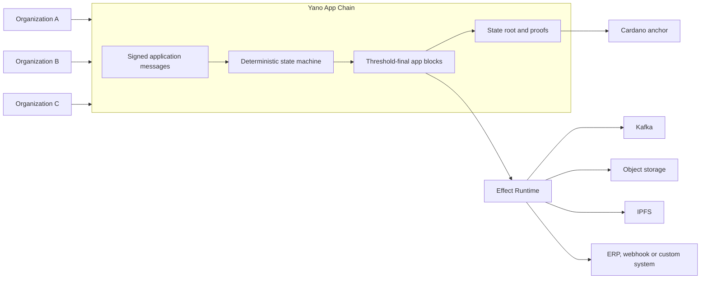
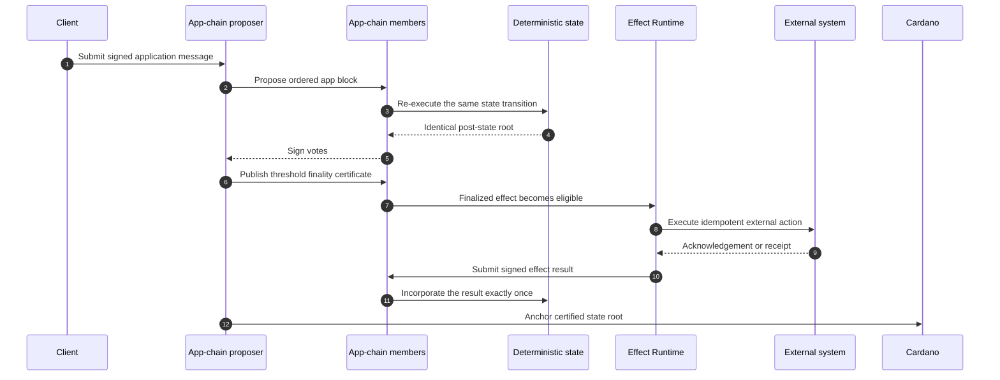
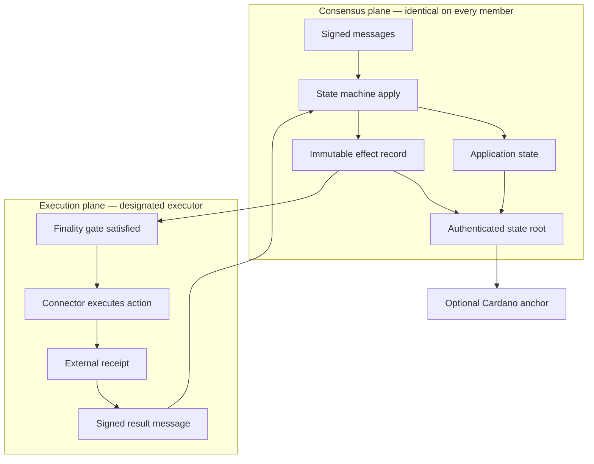
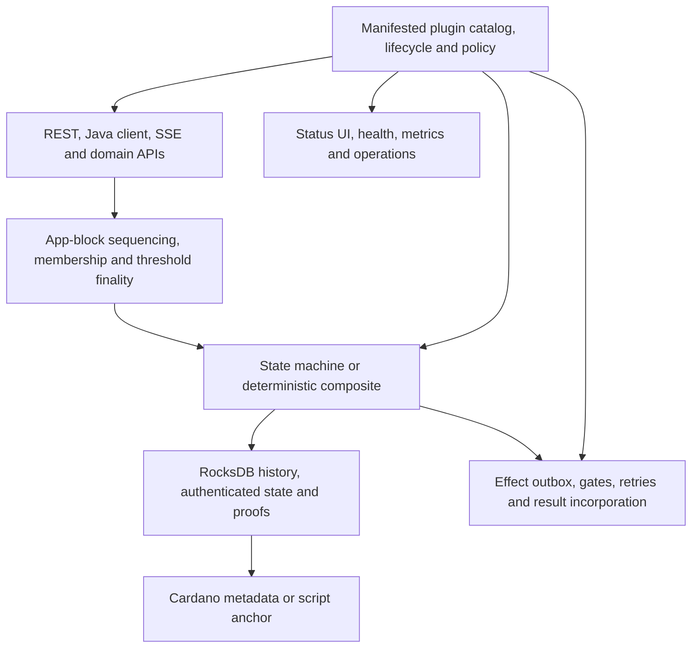
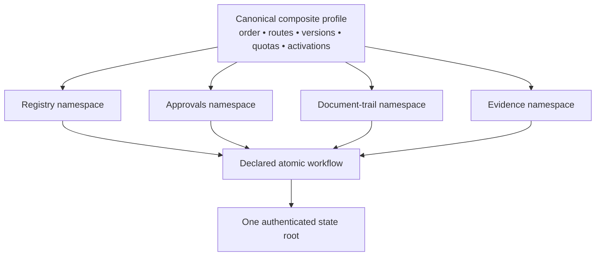
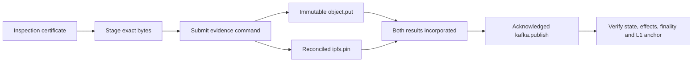
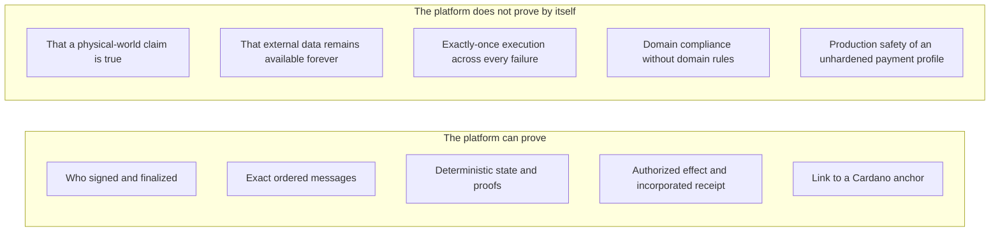
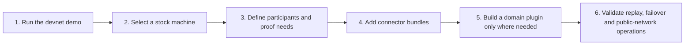

# Yano App Chains — A 10–15 Minute Overview

Yano App Chains are application-specific, replicated ledgers that run alongside
a Yano Cardano node. A group of organizations can agree on application
messages and deterministic state, prove that state independently, anchor it to
Cardano, and safely authorize work in external systems.

The shortest description is:

> **A programmable, multi-party application ledger with deterministic state,
> threshold finality, proofs, Cardano anchoring, and controlled external
> actions.**

Yano is currently pre-release. The architecture and devnet workflows described
here are implemented and tested; production rollout still requires the normal
network, security, operations, load, and domain-specific validation appropriate
to the application.

A matching editable [10–15 minute presentation deck](YANO_APP_CHAIN_OVERVIEW.pptx)
is available for talks and product discussions.

## 1. The problem it solves

Many business processes span several organizations and systems:

- each participant keeps its own database;
- one operator often controls the shared API or message broker;
- audits reconstruct history after the fact;
- external actions are difficult to tie to an agreed business decision; and
- putting every application event directly on a public blockchain is often too
  slow, costly, public, or inflexible.

An app chain provides a shared application layer without turning every business
operation into a Cardano transaction.

The app chain does not replace Cardano. It supplies application-specific
execution and coordination; Cardano supplies an independently observable
settlement and timestamping layer for committed app-chain state.

## 2. What makes it an app chain

| Characteristic | What it means | Why it matters |
|---|---|---|
| Signed participation | Members and messages have cryptographic identities. | The system knows who submitted and approved an action. |
| Deterministic execution | Every member applies the same messages through the same state machine. | Honest members derive the same state root byte for byte. |
| Threshold finality | An app block is final only after the configured member threshold signs it. | No single database or broker operator decides history. |
| Hash-linked blocks | Finalized blocks commit to prior history. | Reordering or rewriting history is detectable. |
| Provable state | Application state is stored in an MPF trie with inclusion and exclusion proofs. | A client can verify a record against a root without trusting one node. |
| Cardano anchoring | A finalized root can be written to a metadata or script anchor on Cardano. | Auditors can bind app-chain evidence to public L1 history. |
| Deterministic effects | State machines authorize external work by emitting immutable effect records. | Network I/O never contaminates consensus execution. |
| Catch-up and recovery | Restarted or joining members fetch and independently verify finalized history. | Recovery does not require trusting a database copy. |
| Plugins and presets | State machines, executors, sinks, APIs, queries, health, and metrics are extensible. | A domain can evolve without forking the consensus framework. |

## 3. The end-to-end process

In practical terms:

1. A client submits a signed message to an application topic.
2. The proposer orders accepted messages into an app block.
3. Every member validates the block and independently executes the selected
   state machine.
4. Members sign only the state root they derived themselves.
5. The block becomes final when the configured signature threshold is met.
6. Clients can query state and request proofs bound to that finalized root.
7. If the transition emitted an effect, an executor performs it only after its
   configured finality gate is satisfied.
8. For tracked effects, the signed result returns through the app chain and is
   incorporated deterministically.
9. An optional Cardano anchor commits the certified app-chain root to L1.

## 4. The two-plane design

The most important safety boundary is the separation of deterministic intent
from non-deterministic execution.

The state machine records **what is authorized**. It never calls Kafka, IPFS,
S3, Cardano, an ERP, or a webhook during consensus. The Effect Runtime executes
the instruction later and reports the outcome.

The guarantee is:

- **exactly-once deterministic result incorporation**; and
- **at-least-once external execution**.

Executors and downstream consumers must therefore be idempotent. An external
operation may already have succeeded when its acknowledgement is lost.

## 5. The major components

| Component | Responsibility | Key property |
|---|---|---|
| App-chain API and clients | Submit messages, inspect blocks, query state, stream finality, and verify proofs. | Clients can verify evidence rather than trust a response. |
| Proposer/sequencer | Orders accepted messages and proposes app blocks. | Ordering role; it cannot force members to sign a wrong root. |
| Members | Validate, re-execute, vote, catch up, and retain finalized history. | Threshold control and independent verification. |
| State machine | Interprets application message bodies and writes deterministic state. | No wall clock, randomness, or external I/O. |
| Authenticated state | Commits state under one root and serves bounded proofs. | Same root across members and anchorable to Cardano. |
| Anchor subsystem | Publishes certified roots as Cardano metadata or a state-thread script UTxO. | Public L1 linkage without executing the application on L1. |
| Effect Runtime | Discovers finalized effects, applies gates, retries, tracks receipts, and reports results. | External failures do not fork or block consensus. |
| Plugin catalog | Validates manifested bundles, dependencies, compatibility, policy, and lifecycle. | Extensibility remains explicit and auditable. |
| Operations surfaces | Status, health, Prometheus metrics, dashboards, admin and plugin operations. | Operators can distinguish intent, execution, incorporation, and anchoring. |

## 6. Start without code; extend without forking Yano

```mermaid
flowchart LR
    subgraph NC[Configuration only]
        OL[ordered-log]
        KV[kv-registry]
        AP[approvals]
        BA[balances]
        DT[doc-trail]
        EV[composite / evidence-v1-gated]
    end

    subgraph FP[First-party integration bundles]
        KA[kafka.publish]
        S3[object.put]
        IP[ipfs.pin]
        WH[webhook.post]
        CP[cardano.payment preview profile]
    end

    subgraph CUSTOM[Custom manifested bundle]
        CSM[Domain state machine]
        CC[Custom composite profile]
        CE[Custom effect executor]
        CA[Domain API and queries]
        CO[Health, metrics and operations]
    end

    NC --> FP --> CUSTOM
```

### No-code path

A team can select a stock state machine and configure members, threshold,
anchoring, retention, and APIs. The default `evidence-v1-gated` preset combines
registry, approvals, document trail, and approval-coordinated evidence
publication under one state root. The compatibility `evidence-v1` preset keeps
direct evidence commands for existing deployments. The first-party Kafka,
S3-compatible object-store, and IPFS bundles provide a full external
publication workflow without custom application code.

### Plugin path

A JVM deployment can load a self-contained manifested bundle from its plugin
directory and select its state-machine contribution through configuration. A
native image includes selected bundles at build time.

A custom bundle can contribute typed capabilities such as:

- a standalone domain state machine;
- a custom composite that assembles reusable components in an explicitly
  versioned order per profile epoch;
- effect executors and finalized-stream sinks;
- committed queries and bounded domain APIs; and
- plugin health, metrics, and operational actions.

The unit selected by Yano is the complete state machine or composite plugin.
Reusable composite components are normal Java libraries instantiated by that
plugin. This keeps the consensus-visible order, routes, namespaces, versions,
workflows, and quotas explicit.

## 7. Composite state machines

One app chain selects one state machine. A deterministic composite lets that
one machine safely host several reusable capabilities behind a single atomic
state root.

The profile is canonically encoded, committed to authenticated state at height
1, and verified on restart and every transition. A different component order
or effective configuration is therefore detected instead of silently creating
a different application.

Fixed mode retains one immutable profile. Governed mode commits an append-only
profile epoch chain: operators package reviewed current and dormant targets on
every member first, then threshold-authorize one exact digest and future
activation height. YAML or JAR changes alone never change consensus behavior.

Components cannot read or write sibling namespaces directly. Cross-component
changes use a declared deterministic workflow. Existing `AppStateMachine`
implementations can be wrapped as components when they obey routed-block and
namespaced-state boundaries.

## 8. A complete example: evidence publication

The no-code demonstration uses a product inspection certificate:

The scenario verifies:

- exact archived object bytes, checksum, version, retention identity, and
  destination fingerprint;
- exact IPFS CID, retrieved bytes, and configured pin state;
- Kafka destination fingerprint, event bytes, partition, and offset;
- identical committed state across three app-chain members;
- state and effect inclusion proofs bound to the same root;
- threshold-signed finality evidence; and
- the Cardano script-anchor transaction, state-thread token, and canonical
  inline datum.

It also tests executor failure after an external acknowledgement, fenced
failover, reconciliation without duplicate mutation, and restart with retained
state. The same scenario runs through Docker Compose and ordinary host
processes.

## 9. Practical use cases

| Use case | Starting point | Typical extension |
|---|---|---|
| Consortium audit log | `ordered-log`, proofs, optional Cardano anchor | Domain-specific message codec or query API |
| Shared registry or allow-list | `kv-registry` | Validation rules and domain API |
| Multi-party approvals | `approvals` | Custom workflow and external notification |
| Internal credits or netting | `balances` | Domain authorization and settlement connector |
| Document or case history | `doc-trail` | Object storage/IPFS evidence publication |
| Compliance evidence publication | `composite/evidence-v1-gated` plus Kafka, object storage and IPFS | Domain actor authorization or regulator-specific policy |
| Digital product passport | Registry, approvals, document trail, evidence connectors | DPP actor model, credential policy, product schemas and lifecycle workflows |
| Oracle observation ledger | Ordered observations, approvals/aggregation, proofs | Source adapters, quorum/outlier rules, and hardened Cardano datum publication |
| Cross-organization workflow | Custom composite plus effects | ERP, webhook, Kafka, storage, identity and domain APIs |
| Application-specific settlement | Deterministic balances/approvals | Production-hardened Cardano transaction and reconciliation plugin |

The reusable platform proves what identified participants finalized and what
publication instruction they authorized. Domain plugins remain responsible for
what counts as a valid product event, approval, oracle observation, inspection,
or settlement.

## 10. What the evidence proves—and what it does not

For example, an oracle app chain can prove that its configured participants
approved and published a particular observation. Truth about the underlying
price, sensor, or event still depends on source selection, signatures,
aggregation, outlier handling, and governance implemented by the oracle domain.

## 11. Deployment and operational model

- **JVM:** copy a self-contained manifested bundle to every member's plugin
  directory, select it in configuration, and restart the nodes. No Yano rebuild
  is required.
- **Native:** include selected plugins before native catalog/reflection
  generation and rebuild the native executable; native processes do not load
  new JARs after build.
- **Multiple chains:** one node can host multiple independently configured app
  chains.
- **Executor placement:** effects may run on a designated member, a dedicated
  executor node, or through the external claim/report API. Type partitions and
  stable executor identities make ownership visible and recoverable.
- **Operations:** REST status, health, Prometheus metrics, plugin inventory,
  dashboards, effect operations, evidence export, snapshots, and admin
  workflows are available.
- **Data lifecycle:** app-chain state, L1 state, connector state, identities,
  and cleanup scopes are explicitly separated and guarded against accidental
  cross-network reuse.

## 12. Current readiness

The implemented devnet acceptance path covers:

- real three-member consensus and threshold finality;
- deterministic replay, restart, snapshot restore, and member catch-up;
- state/effect proofs and script anchoring;
- Kafka, S3-compatible object storage, and Kubo/IPFS success, retry, outage,
  restart, reconciliation, and conflict paths;
- executor fencing and failover after an external acknowledgement;
- fresh and retained deployments through Compose and ordinary host processes;
- JVM plugin-directory packaging and build-time native plugin inclusion;
- Linux ARM64 native startup with the stock governed composite profile;
- authenticated governed-profile activation, retired-generation effect
  callbacks, replay/restart/snapshot recovery, and governance-aware proofs; and
- independent consensus/determinism and plugin/security reviews with no
  unresolved Critical, High, or Medium findings in ADR-013/ADR-015 scope.

Before a production launch, plan application-specific public-network soak and
load testing, key and secret operations, monitoring/SLOs, incident recovery,
governance, domain validation, and any required Cardano payment hardening.

## 13. A practical adoption path

Start with the smallest state machine that expresses the shared decision. Add
effects only for external actions that must be tied to finality. Introduce a
custom composite when several deterministic capabilities truly need one atomic
state root. Keep business truth and authorization explicit in the domain
plugin.

## 14. Where to go next

- [App-chain user guide](APP_CHAIN_USER_GUIDE.md) — configuration, APIs,
  anchoring, effects, composite profiles, operations, and troubleshooting.
- [App-chain tutorial](APP_CHAIN_TUTORIAL.md) — run a cluster and build a
  custom state-machine plugin.
- [Consensus and internals guide](APP_CHAIN_CONSENSUS_GUIDE.md) — exact
  consensus, state-machine, proof, catch-up, and wire-format behavior.
- [Effects demo](../app/appchain-effects-demo/README.md) — the complete
  Kafka/object-store/IPFS evidence scenario in Compose and normal deployment.
- [Composite state-machine guide](../appchain/appchain-composite/README.md) —
  stock preset and custom-composition rules.
- [Composite profile-governance runbook](APP_CHAIN_PROFILE_GOVERNANCE.md) —
  deploy-first/activate-second operations and proof verification.
- [Plugin operations guide](PLUGIN_OPERATIONS.md) — catalog, lifecycle,
  authentication, health, metrics, dashboard, JVM, and native behavior.
