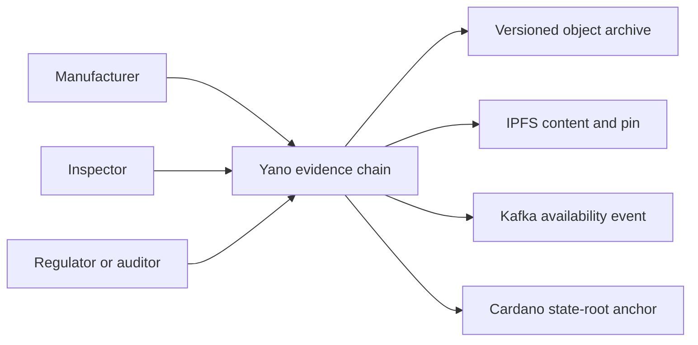
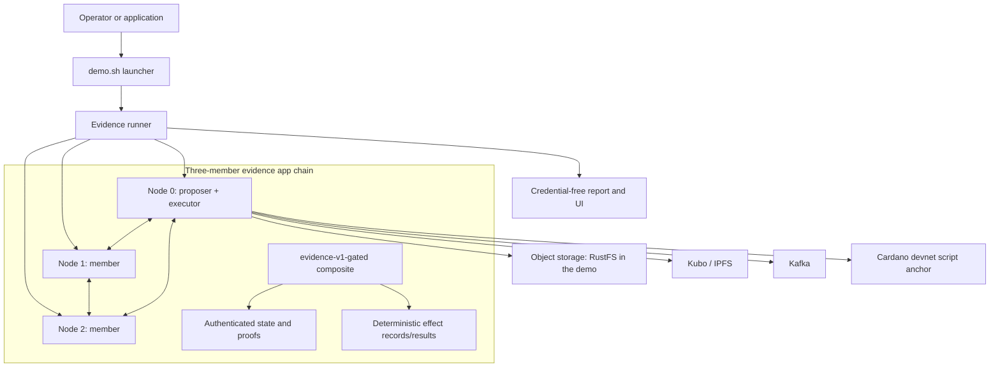
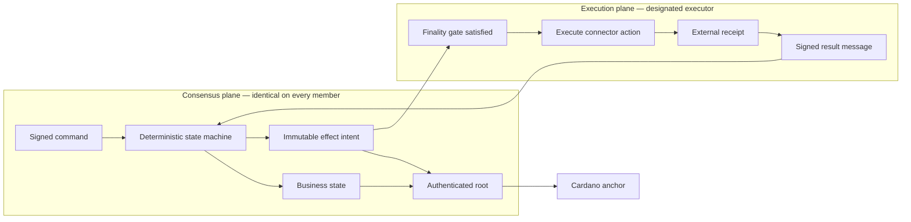
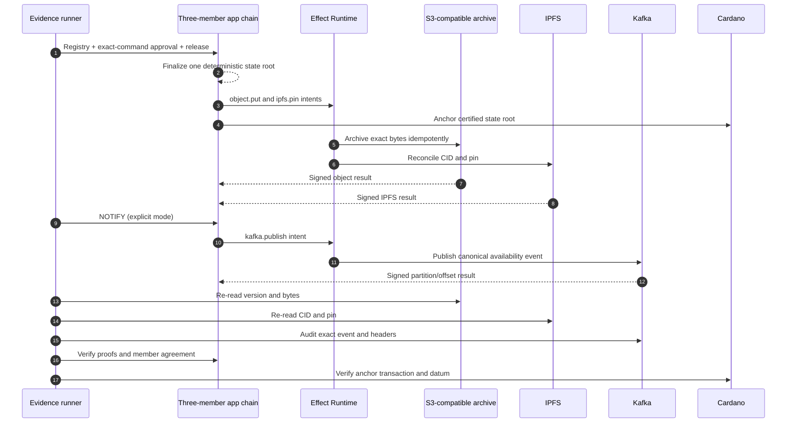
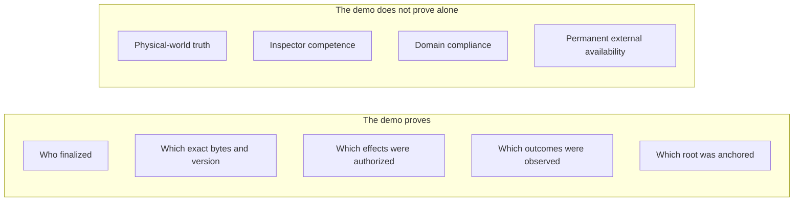

# Yano Evidence Chain Demo — Plain-Language End-to-End Guide

This guide explains the evidence-chain demo without requiring knowledge of
Yano internals. It is designed for a 30-minute introduction, including a short
live demonstration.

The shortest description is:

> Several organizations agree on an evidence record, preserve its exact bytes
> in external systems, make the result independently verifiable, and anchor
> the agreed state to Cardano.

The demo uses an inspection certificate as the example. The same design can
support compliance evidence, document registries, product passports, shared
approvals, audit trails, or other multi-party workflows.

Yano is currently pre-release. This demo is an implemented and tested devnet
reference workflow, not a claim that every domain or production environment
is ready without its own security, governance, operations, and validation.

## 1. What problem does the demo solve?

Imagine a manufacturer, inspector, and regulator that need to share an
inspection certificate.

With a conventional integration:

- one organization usually owns the database or API;
- the others must trust that operator's history;
- the document, business record, notifications, and audit trail can drift;
- it is difficult to prove which exact bytes were approved; and
- external retries can accidentally create duplicate actions.

The evidence chain gives the participants one agreed application history
without putting the whole document or every workflow step on Cardano.



## 2. What is the demo's business outcome?

At the end of one successful publication:

1. the three app-chain members have finalized the same evidence record;
2. the record identifies one immutable business version and document hash;
3. the exact bytes are preserved in versioned object storage;
4. the same content is available by its IPFS CID and is pinned;
5. Kafka contains an acknowledged `evidence.available.v1` event;
6. the connector receipts are incorporated into authenticated app-chain
   state;
7. clients can verify state, effect, and finality proofs; and
8. Cardano contains an anchor covering the certified app-chain state root.

The final business status is `READY` only after the required storage and
notification outcomes have been incorporated.

## 3. The system at a glance



Only node 0 has connector credentials and executes effects in the default
demo. Nodes 1 and 2 still validate every deterministic effect instruction,
incorporated result, block, and state root. A wrong result cannot become final
unless the configured member threshold accepts the resulting state.

## 4. Which component does what?

| Component | Responsibility | It deliberately does not do |
|---|---|---|
| `demo.sh` launcher | Builds or stages artifacts, creates private configuration, starts/stops the environment, guards identities and cleanup, and invokes the runner. | It does not decide consensus state. |
| Evidence runner | Performs safe preflight, stages the selected file, submits workflow commands, waits for finality, independently re-reads external systems, verifies proofs, and writes reports. | It is not a member and cannot rewrite chain state. |
| Proposer | Orders accepted messages into candidate app blocks. | It cannot force honest members to sign a state root they did not derive. |
| Three members | Validate messages, independently execute the state machine, derive the same root, and provide threshold finality. | They never call Kafka, S3, or IPFS during consensus. |
| `evidence-v1-gated` composite | Combines registry, approval, document-trail, and evidence rules under one atomic root. | It cannot make network calls or read wall-clock time. |
| Authenticated state | Stores business records, versions, statuses, effect commitments, results, and the active profile commitment; serves inclusion/exclusion proofs. | It does not store the full inspection document. |
| Effect Runtime | Finds finalized effect instructions, applies finality gates, retries idempotently, records execution progress, and submits signed results. | It does not alter the original deterministic instruction. |
| S3-compatible executor | Copies the staged bytes to the versioned archive and reports an exact version/destination receipt. | Credentials and endpoints never enter consensus payloads. |
| IPFS executor | Reconciles the expected CID and pin state and reports the target fingerprint. | It does not treat a different CID as success. |
| Kafka executor | Publishes the canonical event with reserved Yano headers and returns partition/offset acknowledgement. | It does not promise cross-process exactly-once delivery; consumers still deduplicate by effect ID where necessary. |
| Cardano anchor | Commits a certified app-chain height, block hash, and state root through the state-thread script UTxO. | It does not contain or execute the inspection document. |
| Evidence UI | Keeps the latest publication visible, lazily pages/searches retained evidence 20 versions at a time, and shows a selected report plus a bounded JSON presentation copy only after object-store and IPFS byte verification. | It receives no connector or Yano administrator credential and never reads the original local sample. |

## 5. Why consensus and external execution are separate

Network calls are non-deterministic: a broker can be slow, an object store can
time out, and an acknowledgement can be lost. Performing those calls inside a
state machine could make different members produce different state.

Yano instead separates intent from execution:



The guarantee is **exactly-once deterministic result incorporation over
at-least-once external execution**. Connectors therefore use the effect ID and
destination-specific reconciliation rules to make retries safe.

## 6. Publication flow, step by step

### Phase A — prove that the request is safe

1. The launcher takes the operation lock and copies a bounded, owner-controlled
   regular file into a private operation location.
2. The runner hashes the bytes and asks all three nodes for a proof-bound view
   of the evidence ID and active composite profile.
3. For `publish`, the ID must be absent. For `republish`, the owner and exact
   next version must match. A mismatch fails before any external write.

### Phase B — obtain multi-party authorization

4. The composite registry binds the evidence identity.
5. The exact evidence command is proposed for approval.
6. The configured approval is recorded.
7. `evidence.release.v1` atomically appends the document trail and creates the
   evidence record. The resulting deterministic transition emits
   `object.put` and `ipfs.pin` effects.

### Phase C — preserve the bytes outside consensus

8. After the configured finality gate is satisfied, the designated executor
   archives the exact bytes in object storage and reconciles the IPFS CID/pin.
9. Signed results return as ordinary app-chain messages.
10. Every member incorporates each terminal result exactly once. When both
    storage results are confirmed, the record is storage-ready.

### Phase D — announce availability and prove the outcome

11. In the default `explicit` profile, the runner submits an idempotent
    `NOTIFY` command. In a fresh `direct` profile, the second incorporated
    storage result deterministically emits the Kafka effect without that extra
    command.
12. The Kafka executor publishes `evidence.available.v1`; its acknowledgement
    returns to authenticated state and the evidence becomes `READY`.
13. The runner re-reads the exact object version, IPFS bytes/pin, and Kafka
    record instead of trusting only the executor receipt.
14. It verifies three-member agreement, state/effect proofs, threshold
    finality, and the covering Cardano anchor, then writes a report.



## 7. What data goes where?

| Location | Data retained there | Data not placed there |
|---|---|---|
| App-chain authenticated state | Evidence ID, owner, business version, document hash/size/reference, status, effect identities, expected target fingerprints, terminal receipts, active profile commitment. | Full document bytes, connector credentials, private endpoints, or signing secrets. |
| App-chain finalized history | Ordered signed messages, block metadata, finality certificates, state roots, effect/result transitions. | Mutable execution-attempt details that differ by node. |
| Object staging bucket | Private operation input under an allowed staging prefix. | Consensus or member signing keys. |
| Versioned object archive | Exact evidence bytes, immutable version identity, checksum, and provider metadata. | App-chain private keys. |
| IPFS/Kubo | Content-addressed bytes and pin state under the expected CID. | Authorization policy or business truth. |
| Kafka | Canonical availability event, effect ID and reserved Yano headers, partition and offset. | Connector credentials or the complete app-chain database. |
| Cardano | Script-anchor transaction, thread token, and inline datum binding app-chain identity, height, block hash, state root, members, and threshold. | Inspection document or every app-chain message. |
| Local report directory/UI | Sanitized outcome, IDs, hashes, proofs verified, external receipts, anchor linkage, failure code, and an owner-readable bounded JSON presentation copy produced from externally verified bytes. | API keys, S3 secrets, member seeds, raw administrator configuration, or unverified source input. |

The archive key is version-specific:

```text
<evidence-id>/v<business-version>/inspection-certificate.bin
```

Changing a JSON field does not automatically create a new business version.
The caller must explicitly use `republish` with exactly `latest + 1`.

## 8. What can a verifier prove?

The completed report can demonstrate that:

- the configured members finalized a particular ordered transition;
- independent members derived the same authenticated root;
- a particular evidence record and effect/result tuple existed under that
  root;
- exact bytes were observed at the recorded object-store version and IPFS CID;
- the expected Kafka record was observed at the acknowledged partition/offset;
- the finality threshold was met; and
- a Cardano transaction anchored a state root covering the evidence.

It does **not** prove by itself that the real-world inspection claim is true.
Truth still depends on who may submit, how inspectors are identified, which
signatures or credentials are required, and the domain validation implemented
by the application profile or plugin.



## 9. Business lifecycle commands

| Command | Meaning | Expected mutation |
|---|---|---|
| `run` | Guided command: publish an absent default ID, verify matching retained bytes, or request explicit republish for changed content. | Publish or no mutation. |
| `publish` | Create business version 1 for a new evidence ID. | New record, effects, external objects/event, blocks, and anchor. |
| `republish` | Create exactly the next immutable version for the same owner. | New version and new version-scoped connector outcomes; old versions remain verifiable. |
| `verify` | Re-read and verify latest or historical evidence. | No app message, effect, external write, or forced anchor. |
| `replay` | Resubmit the exact accepted command to demonstrate deterministic idempotency. | New envelope may finalize; business root, effects, and logical external outcomes remain unchanged. |
| `load` | Publish bounded independent IDs using either lifecycle or pipeline scheduling. | Same mutations as multiple normal publications. It is a correctness/capacity/soak tool, not raw ingress benchmarking. |

### 9.1 Current end-to-end demo steps

From `app/appchain-effects-demo`, start one retained explicit-continuation
cluster and keep it running for every command below:

```bash
./demo.sh up --instance evidence-talk

# Publish and independently verify one product/evidence identity.
./demo.sh publish --instance evidence-talk \
  --evidence-id inspection-product-a \
  --sample-file samples/inspection-certificate.json
./demo.sh verify --instance evidence-talk \
  --evidence-id inspection-product-a --business-version 1

# Add the exact next immutable version; version 1 stays queryable.
./demo.sh republish --instance evidence-talk \
  --evidence-id inspection-product-a --business-version 2 \
  --sample-file samples/inspection-certificate-product-a-v2.json

# Default correctness mode: each worker completes a full workflow per item.
./demo.sh load --instance evidence-talk \
  --count 8 --concurrency 3 --id-prefix lifecycle-talk \
  --sample-file samples/inspection-certificate.json

# Capacity mode: bounded stages overlap across independent evidence IDs.
./demo.sh load --instance evidence-talk --load-mode pipeline \
  --count 8 --concurrency 8 --max-in-flight 8 \
  --id-prefix pipeline-talk \
  --sample-file samples/inspection-certificate.json

# Verify a pipeline-created record independently and inspect the UI/status.
./demo.sh verify --instance evidence-talk \
  --evidence-id pipeline-talk-000008 --business-version 1
open http://127.0.0.1:7080/
./demo.sh status --instance evidence-talk

./demo.sh stop --instance evidence-talk
```

`up` automatically prepares/builds the current tree when required. Use a new
evidence ID or load prefix for each new record set. `verify` is read-only: it
re-reads the stored object and IPFS bytes, checks the Kafka acknowledgement,
state/finality proofs, and the Cardano anchor without publishing another app
message. The Evidence Explorer shows individual immutable versions and the
aggregate schema-v2 load report.

Lifecycle mode is the default and is easiest for functional diagnosis.
Pipeline mode keeps six dependency-ordered stages busy across different IDs;
it does not bypass approvals, deterministic state transitions, effects,
external re-reads, proofs, or L1-gated finality. The demo commits capacity for
eight releases per block. `--max-in-flight` bounds all active and queued items,
up to 5,000, while `--concurrency` bounds stage workers. The former counts
workflows, not simultaneous mempool messages; each workflow submits several
dependency-ordered messages and waits for finality between stages. Treat
displayed rates as results for the current machine and deployment, not
universal TPS.

Direct continuation is an alternative immutable profile for a fresh instance.
Pass `--continuation direct` to every command for that instance:

```bash
./demo.sh up --instance evidence-direct --continuation direct
./demo.sh load --instance evidence-direct --continuation direct \
  --load-mode pipeline --count 8 --concurrency 8 --max-in-flight 8 \
  --id-prefix direct-talk \
  --sample-file samples/inspection-certificate.json
./demo.sh verify --instance evidence-direct --continuation direct \
  --evidence-id direct-talk-000008 --business-version 1
./demo.sh stop --instance evidence-direct --continuation direct
```

The default `explicit` profile submits a post-publication continuation command.
The `direct` profile emits Kafka after the required storage results are
incorporated. Both create and verify the same business outcome. Because the
mode and capacity are committed profile identity, changing either requires a
new disposable demo chain or governed production profile activation.

## 10. Failure and retry behavior

External systems can fail without forking consensus.

- If an executor crashes before acting, another attempt can execute the same
  immutable effect.
- If it crashes after the external action but before recording the receipt,
  the connector reconciles by effect ID, object version, CID/pin, or Kafka
  audit rules before acting again.
- A timeout is not treated as proof of absence.
- A conflicting external object or receipt fails closed.
- Only a valid signed result is incorporated, and the first terminal result
  wins deterministically.
- Restarted members replay finalized history and independently rebuild the
  same state root.

Kafka delivery remains at-least-once across process/acknowledgement loss.
Consumers that cannot tolerate a duplicate physical record should deduplicate
using the reserved `yano-effect-id` header.

## 11. Why this is useful

The demo combines five benefits that are normally spread across separate
systems:

1. **Shared control:** multiple members finalize history; one database owner
   does not unilaterally decide it.
2. **Small, verifiable on-chain footprint:** Cardano receives the certified
   root, not every private document or business message.
3. **Exact data linkage:** hashes, version identifiers, CIDs, offsets, receipts,
   and proofs tie the business record to external data.
4. **Safe automation:** deterministic effects authorize external work without
   performing network I/O inside consensus.
5. **Practical extensibility:** stock components and first-party connectors
   work without domain code; custom rules, APIs, workflows, and executors can
   be supplied through manifested plugins.

## 12. No-code today, domain plugins when needed

The demo itself requires no application Java code. It uses:

- the stock `evidence-v1-gated` deterministic composite;
- first-party `object.put`, `ipfs.pin`, and `kafka.publish` executors;
- the launcher and evidence runner; and
- configuration for members, threshold, connector targets, and anchoring.

A production domain can later add a manifested plugin for:

- actor roles and credential validation;
- product, inspection, or compliance schemas;
- additional approval or quorum rules;
- domain queries and REST APIs;
- a custom composite profile with an explicitly committed order;
- new effect executors; or
- bounded health, metrics, and operational actions.

The deterministic state-machine/profile identity is consensus-critical. A new
profile or continuation mode is selected for a new chain or activated through
governed profile evolution; it is not silently changed by replacing YAML or a
JAR on one member.

## 13. Suggested 30-minute presentation and demo

### Minutes 0–5 — the problem and promise

- Describe the three-organization inspection example.
- Explain why a shared API/database is not independently verifiable.
- State the outcome: one agreed record, preserved bytes, acknowledged event,
  proofs, and a Cardano anchor.

### Minutes 5–12 — the architecture

- Show the three-member app chain and threshold finality.
- Explain the deterministic composite and authenticated state root.
- Explain the consensus/execution separation and effect receipts.

### Minutes 12–18 — follow one evidence record

- Walk through approval/release, S3, IPFS, Kafka, result incorporation, and
  Cardano anchoring.
- Use the data-location table to show that the document and secrets are not
  written to the chain.
- State what is proven and what remains a domain truth question.

### Minutes 18–26 — live demonstration

From `app/appchain-effects-demo`:

```bash
# Start one retained three-node environment.
./demo.sh prepare --instance talk-demo
./demo.sh up --instance talk-demo

# Publish a first immutable record.
./demo.sh publish --instance talk-demo \
  --evidence-id inspection-product-a \
  --sample-file samples/inspection-certificate.json

# Open the Evidence Explorer. The latest record stays in the overview;
# use Previous/Next or search to select any immutable version while the
# server fetches only 20 records at a time, then inspect its JSON and proofs.
open http://127.0.0.1:7080/

# Verify without changing chain or external state.
./demo.sh verify --instance talk-demo \
  --evidence-id inspection-product-a

# Demonstrate immutable-ID protection: this should fail safely.
./demo.sh publish --instance talk-demo \
  --evidence-id inspection-product-a \
  --sample-file samples/inspection-certificate-product-b.json

# Create the exact next immutable version.
./demo.sh republish --instance talk-demo \
  --evidence-id inspection-product-a --business-version 2 \
  --sample-file samples/inspection-certificate-product-a-v2.json

# Optionally show bounded multi-item capacity after the lifecycle story.
./demo.sh load --instance talk-demo --load-mode pipeline \
  --count 8 --concurrency 8 --max-in-flight 8 \
  --id-prefix talk-pipeline \
  --sample-file samples/inspection-certificate.json
```

During the demo, show:

- all three node status pages at ports `7070`, `7071`, and `7072`;
- the evidence UI at port `7080`;
- selection of an older evidence version while the latest overview remains
  unchanged;
- the actual JSON re-read from the immutable object version and matched to
  IPFS, including the displayed SHA-256 confirmation;
- version 1 and version 2 as separate historical records;
- the three effect outcomes;
- state/finality proof checks; and
- the Cardano anchor linkage.

Use custom port environment variables if these ports are occupied. Run
`./demo.sh stop --instance talk-demo` after the session; `stop` preserves data.

### Minutes 26–30 — benefits and extension path

- Summarize shared control, provability, safe automation, and small L1
  footprint.
- Explain the no-code stock path and the manifested-plugin path.
- Ask which participant, evidence, approval, and external-action rules the
  audience's real use case needs.

## 14. Useful links

- [App-chain overview](APP_CHAIN_OVERVIEW.md)
- [Evidence demo operator README](../app/appchain-effects-demo/README.md)
- [App-chain user guide](APP_CHAIN_USER_GUIDE.md)
- [App-chain tutorial](APP_CHAIN_TUTORIAL.md)
- [Composite profile governance](APP_CHAIN_PROFILE_GOVERNANCE.md)
- [ADR-013: connectors and no-code demo](../adr/app-layer/013-first-party-integration-connectors-and-effect-demo.md)
- [ADR-013.2: deterministic composite](../adr/app-layer/013.2-deterministic-composite-state-machine.md)
- [ADR-018: evidence lifecycle](../adr/app-layer/018-evidence-demo-iteration-2-publish-republish-verify.md)
