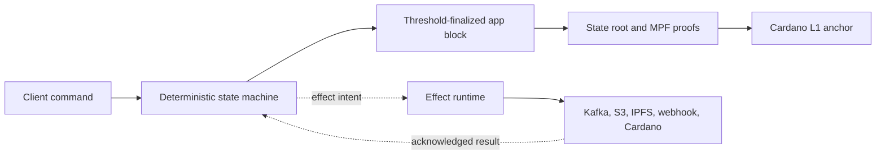

# Yano App Chains — Start Here

This is the task-oriented entry point for Yano app chains. It is designed for
two kinds of reader:

- **New to app chains:** start a local three-member chain, submit useful data,
  and see what is finalized before learning the internals.
- **Experienced distributed-systems or blockchain developer:** jump directly
  to state proofs, L1 anchoring, deterministic composition, effects, plugins,
  governance, and operational boundaries.

The tutorials use the current source tree. Yano is still pre-release; use local
devnet or a Cardano test network, disposable application data, and non-production
credentials unless a guide explicitly says otherwise.

## Choose your first outcome

| I want to… | Start with | Coding required? |
|---|---|---:|
| See three members finalize the same events | [Your first app chain](tutorials/01-first-app-chain.md) | No |
| Use or customize the built-in append-only event log | [`ordered-log` reference](state-machines/ordered-log.md) | No, unless adding business rules |
| Maintain a provable owner-controlled registry | [`kv-registry` reference](state-machines/kv-registry.md) | No |
| Collect member approvals and optionally trigger an action | [`approvals` reference](state-machines/approvals.md) | Configuration + typed commands |
| Maintain a document-hash trail per product or case | [`doc-trail` reference](state-machines/doc-trail.md) | Configuration + typed commands |
| Select a stock ledger/workflow capability | [Stock state-machine cookbook](tutorials/03-stock-state-machines.md) | Configuration + typed commands |
| Publish immutable evidence to object storage/IPFS and notify Kafka | [Evidence publication](tutorials/04-evidence-publication.md) | No |
| Require manufacturers, auditors, and regulators to sign by domain role | [Domain-role approvals](tutorials/05-domain-role-approvals.md) | No for the stock scenario |
| Call an ERP/API after a finalized decision | [Webhook effects](tutorials/06-webhook-effects.md) | Configuration; emission is stock or plugin logic |
| Understand and verify Cardano settlement | [Anchors and independent verification](tutorials/07-anchors-and-verification.md) | No |
| Implement new business rules without forking Yano | [Plugins and composites](tutorials/08-plugins-and-composites.md) | Small Java plugin |
| Prepare a pilot deployment | [From demo to pilot](tutorials/09-from-demo-to-pilot.md) | Operations work |

If you are unsure, complete tutorials 1, 2, 4, and 5 in that order. They show
the progression from a replicated log to proofs, external actions, and
business-role authorization.

## What ships out of the box

```text
Deterministic state                    External action
───────────────────────────────────    ───────────────────────────────
ordered-log                            webhook.post
kv-registry                            kafka.publish
approvals                              object.put
balances                               ipfs.pin
doc-trail                              cardano.payment (preview executor)
evidence-v1-gated composite
role-evidence composite
```

The left side runs identically on every member and contributes to the state
root. The right side runs after the relevant finality gate and reports an
outcome through the effect system. External execution is at-least-once; effect
outcome incorporation is exactly once. Receivers must honor the supplied
idempotency identity.

## The mental model

An app chain has four layers:



1. A member authenticates and relays a command.
2. The proposer orders commands into an app block.
3. A threshold of members signs the same block and state root.
4. State and effect intents become provable against that root.
5. An optional anchor settles the root on Cardano.
6. Effect executors act outside consensus and report bounded outcomes.

For role-aware workflows, the relay member and the business actor are separate
identities: a node transports a command; an actor signature authorizes its
business meaning.

## Learning tracks

### Beginner: operate first, understand second

1. Use the self-contained devnet. No Cardano funds or external node is needed.
2. Submit through `./yano.sh appchain cluster` rather than constructing wire bytes.
3. Compare tips and roots on all members.
4. Inspect one proof and one intentional no-op/failure.
5. Stop while keeping data, restart, and verify the same state.

### Application developer

1. Choose a stock machine or committed composite profile.
2. Use the Java client or REST API for typed commands and proof queries.
3. Add a small composite plugin when existing components need new ordering or
   terminal transitions.
4. Add a custom state-machine plugin only for genuinely new state or rules.
5. Treat any change to deterministic application semantics as a versioned
   consensus upgrade, not an ordinary rolling code change.

### Platform and security engineer

1. Verify finality certificates and MPF proofs independently.
2. Choose metadata or threshold-script anchoring and define the finality gate.
3. Separate member keys, business-actor keys, API keys, effect credentials, and
   anchor funds.
4. Pin the binary, plugin catalog, committed profile, runtime, and connector
   security profiles across members.
5. Exercise restart, catch-up, restore, executor retry, and root-parity gates.

## Prerequisites used by the tutorials

- Java 25 when building from source.
- Docker Desktop for the complete evidence/connector demo.
- `bash`, `curl`, `jq`, `python3`, and `openssl`.
- From source, build the runnable application once:

```bash
./gradlew :app:quarkusBuild -PskipSigning=true
```

The cluster launcher can also use a released Yano tree; see
[`app/appchain-cluster/README.md`](../../app/appchain-cluster/README.md).

## Reference shelf

Tutorials deliberately stay outcome-focused. Use these references when you
need full detail:

- [10–15 minute overview](../APP_CHAIN_OVERVIEW.md)
- [State-machine references](state-machines/README.md)
- [`ordered-log` state-machine reference](state-machines/ordered-log.md)
- [`kv-registry` state-machine reference](state-machines/kv-registry.md)
- [`approvals` state-machine reference](state-machines/approvals.md)
- [`doc-trail` state-machine reference](state-machines/doc-trail.md)
- [Complete user and configuration guide](../APP_CHAIN_USER_GUIDE.md)
- [Use-case catalogue](../APP_CHAIN_USE_CASES.md)
- [Consensus and state-machine internals](../APP_CHAIN_CONSENSUS_GUIDE.md)
- [Profile governance runbook](../APP_CHAIN_PROFILE_GOVERNANCE.md)
- [Domain actors and role-aware approvals](../APP_CHAIN_DOMAIN_ROLES.md)
- [Plugin query and domain API contract](../APP_CHAIN_PLUGIN_QUERY_AND_DOMAIN_API.md)
- [Canonical open-work tracker](../../adr/app-layer/open_item.md)

## A note on “no code”

No-code means the required state machine, composite, connector, and launcher
already ship with Yano. A real application still sends typed commands and owns
its UI, identity onboarding, key custody, and business data. Configuration
cannot invent arbitrary consensus transitions. New combinations use a small
composite plugin; new domain logic uses a custom state-machine plugin.
