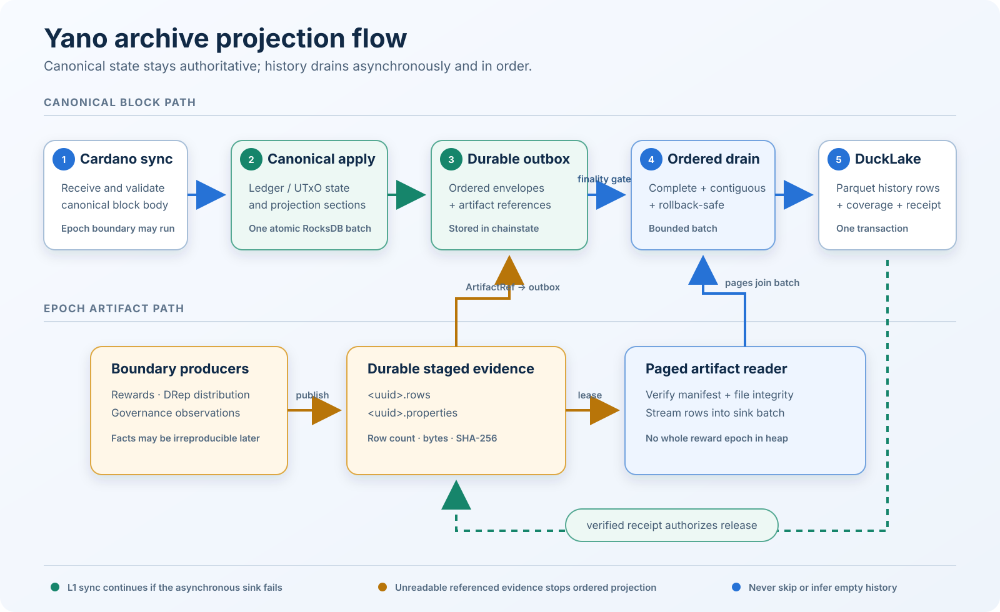

# Archive Projection: End-to-End Design and Recovery

```text
 Cardano peer
      |
      v
 canonical block apply ---- epoch boundary producers
      |                              |
      | atomic RocksDB batch         | durable artifact files
      v                              v
 chainstate + projection outbox <--- artifact references
                   |
                   | ordered + finality-gated
                   v
          projection drain thread
                   |
                   | one DuckLake transaction
                   v
      Parquet rows + coverage + receipt
                   |
                   | receipt verified
                   v
       acknowledge outbox and release
             staged evidence
```



[PNG version of the flow diagram](archive-projection-flow.png)

The archive is an optional, asynchronous read model. Canonical chain and ledger state are the
authority; the archive observes the same accepted blocks and creates query-oriented history
without putting DuckDB, DuckLake, or Parquet on the block-apply critical path.

The shortest useful mental model is:

1. canonical apply writes archive intent to a durable RocksDB outbox;
2. the drain waits until that intent is complete and rollback-safe;
3. DuckLake commits rows and a receipt atomically;
4. only a verified receipt permits outbox cleanup and staged-file deletion.

This document describes the implemented projection path. The column-level DuckLake reference is
in [DUCKLAKE_PROJECTION_SCHEMA.md](DUCKLAKE_PROJECTION_SCHEMA.md). The underlying decisions are
recorded primarily in [ADR-039](../../adr/in-progress/039-canonical-projection-outbox.md),
[ADR-042](../../adr/042-byron-projection-through-utxo-batch.md),
[ADR-044](../../adr/044-selective-epoch-artifact-projection.md), and
[ADR-045](../../adr/045-epoch-artifact-gaps-and-resumable-capture.md).

## 1. What is stored where

There are three distinct durability domains. They must not be treated as one database.

| Domain | Default location | Owns | Can be rebuilt? |
|---|---|---|---|
| Canonical state and projection outbox | `chainstate/` | blocks, UTxO/account state, projection envelopes, artifact references, acknowledgement cursor, pending gap intent | Canonical state comes from sync. Unacknowledged archive intent must be preserved. |
| Epoch staging | `history/epoch-source/` | immutable evidence needed to project boundary-only facts | Some evidence is intentionally irreproducible after its boundary, so it is retained until receipt acknowledgement. |
| Projection archive | `history/ducklake-catalog.sqlite` and `history/ducklake-data/` | DuckLake metadata, Parquet history rows, coverage, identities, and exactly-once receipts | It is a derived read model, but an enrolled fresh-sync archive is not silently rebuilt or patched from incomplete current state. |

The optional `ducklake-catalog.sqlite.tx-locator.sqlite` file is only a transaction-hash lookup
accelerator. It is rebuildable and is never coverage authority.

## 2. Data families

### Block projections

Block projections are deterministic sections carried by every logical block envelope:

| Selector | Main output |
|---|---|
| `transaction:v1` | transactions |
| `utxo-history:v1` | outputs, assets, inputs, datums, and redeemers |
| `account-events:v1` | stake, reward, pool, and governance account events |
| `address-transaction:v1` | address/payment/stake-credential transaction participation |

The selected block-section set is part of the projection identity. A populated archive cannot
quietly add or remove a required section because its older blocks would have a different shape.

### Epoch artifacts

Epoch artifacts describe a completed ledger boundary rather than an ordinary transaction:

| Artifact | Implemented representation | Why |
|---|---|---|
| `epoch-stake` | protected immutable generation | The epoch-keyed snapshot can be read later if pruning is clamped while referenced. |
| `ada-pot` | atomic boundary evidence | The small value can be carried from the committed boundary state. |
| `reward` | staged file | Full calculation output is not proven reproducible from all later retained state. |
| `drep-distribution` | staged file | Rows include boundary-time expiry, dormancy, and activity observations. |
| `governance-proposal-status` | staged file | Status and decision reason are observations at that boundary. |

Epoch artifacts have their own selection and persisted enrollment identity. Adding one to an
existing archive is prospective: its `projectedFromEpoch` is recorded, older epochs are
`NOT_PROJECTED`, and the system must never describe those older epochs as empty or complete.

## 3. Startup and identity checks

With a network profile and the `projection` profile enabled, `ProjectionHistoryService` performs
the following work before starting normal drain:

1. resolve the block section identity and selected epoch-artifact contracts;
2. open the projection outbox inside chainstate RocksDB;
3. initialize or verify the DuckLake archive identity and artifact enrollment;
4. install artifact readers and block contributors;
5. capture or verify genesis distribution independently of block 0;
6. reconcile the outbox and sink coordinate against the canonical body tip;
7. rediscover staged artifact sources and reconcile in-memory leases from pending references;
8. start the single ordered drain thread;
9. route history reads to the initialized archive.

History projection is a fresh-sync facility. Startup refuses identity changes or a populated
archive that lacks required genesis/coverage evidence. It does not guess that an existing set of
rows is compatible.

## 4. Ordinary block flow

```text
receive body
    |
    v
validate and apply canonical state
    |
    +-- normalize facts once
    |
    +-- encode selected projection sections
    |
    +-- write section(s), cursors, and envelope state
    |   in the same RocksDB WriteBatch as their source transition
    v
logical envelope becomes COMPLETE
    |
    v
wait for every prior envelope and the finality cutoff
    |
    v
batch contiguous envelopes within row/byte/time limits
    |
    v
materialize stable ArchiveRow values
    |
    v
DuckLake transaction: rows + epoch coverage + receipt
    |
    v
verify receipt, acknowledge through last block, remove outbox chunks
```

Shelley-and-later sections are staged through canonical apply contributors. Byron main-block
projection is routed through its authoritative UTxO apply batch so it has the same atomicity
property. There is no independent backfill worker racing the live path.

One slow or incomplete contributor can leave canonical core ahead of the archive. That is valid:
the consumer stops at the first incomplete logical envelope and never skips it.

## 5. Finality and batching

The greatest normally eligible block is:

```text
tip block - max(archive finality depth, rollback retention depth)
```

Configuration validation requires archive finality to be at least rollback retention, and
rollback retention to be at least the network security parameter. The expression therefore
normally reduces to `tip - archiveFinalityBlocks`.

The consumer also requires:

- all selected sections for each envelope;
- a contiguous range beginning immediately after the acknowledged coordinate;
- artifact source retention to remain healthy;
- configured batch row/byte safety limits;
- no rollback notification received while the batch was being assembled.

Near tip, a small complete range may wait for the batch linger deadline. During bootstrap, the
consumer favors larger batches for throughput. This means “final in chainstate” and “queryable in
history” are not the same instant.

## 6. Epoch staging flow

For irreproducible datasets, the epoch boundary streams facts to durable local evidence before the
projection references it.

```text
boundary E-1 -> E
    |
    +-- beginBoundary(E)
    |
    +-- producer opens a named part
    |      reward/rewards
    |      reward/pool-reap-000003
    |      reward/governance
    |      reward/mir
    |      drep_distribution/distribution
    |      governance_proposal_status/{lifecycle,ratification}
    |
    +-- append length-prefixed encoded facts to <uuid>.rows.partial
    |
    +-- finish rows, compute row count + byte count + SHA-256
    |
    +-- publish <uuid>.rows, then <uuid>.properties manifest
    |
    +-- publish one completed-boundary marker
    |
    +-- carrier block's RocksDB batch stores ProjectionArtifactRef
    v
outbox owns the durable obligation to archive that UUID
```

The order “rows first, manifest second” is intentional. The manifest makes a job discoverable. A
crash between those publications leaves an orphan rows file that startup can delete, not a visible
job pointing to partial bytes.

Before serving the first row, the staged reader verifies the manifest, size, and checksum. It then
pages the source so reward epochs do not need to be materialized twice in heap. The reference also
carries the expected row count and checksum; a truncated or substituted artifact cannot be
committed as a complete epoch.

Artifact rows join the same DuckLake transaction as their carrier block. `COMPLETE` epoch coverage
and the projection receipt become durable with those rows, never in a separate transaction.

## 7. Are staged artifacts flat files?

Yes, within dataset/part directories. A staged job is normally a pair of flat files:

```text
history/epoch-source/
  completed/
    220-3548238.properties              boundary completion marker
  reward/
    rewards/
      <uuid>.rows                       encoded facts
      <uuid>.properties                 identity, coordinate, counts, checksum
    pool-reap-000003/
      <uuid>.rows
      <uuid>.properties
    governance/
    mir/
  drep_distribution/
    distribution/
  governance_proposal_status/
    lifecycle/
    ratification/
```

The `.rows` file is not Parquet and is not the public archive. It is temporary durable source
evidence. DuckLake converts its facts into archive rows and stores those rows in managed Parquet
files under `ducklake-data/`. After a matching receipt is durable, the staging pair is deleted.

The completion marker covers the boundary. It is removed only when no staged jobs for that
boundary remain.

## 8. Receipt and acknowledgement protocol

Exactly-once effect comes from deterministic batch identity and a receipt committed in the same
DuckLake transaction as the rows.

The successful order is:

1. build a deterministic batch from contiguous envelopes and current artifact references;
2. check for an existing receipt at the batch's first block;
3. if absent, commit rows, coverage, and receipt in one DuckLake transaction;
4. verify that the receipt describes the offered batch;
5. acknowledge each artifact, permitting staged-file or generation release;
6. acknowledge artifact gap repairs;
7. advance the outbox acknowledgement and delete the committed envelope range.

Artifact release precedes outbox reference removal. If a process dies between those two actions,
the reference remains and restart can replay the acknowledgement. If the receipt already exists,
restart does not reread the now-released artifact; it validates the receipt and completes cleanup.

## 9. Restart recovery

On an ordinary restart:

- RocksDB restores the acknowledged coordinate and all later envelopes/references;
- staged `.rows`/`.properties` pairs remain on disk;
- incomplete `.partial` and temporary manifest files are cleaned;
- expired read-lease files are cleaned, but pending evidence is not deleted merely because a
  process lease expired;
- the sink coordinate is compared with the canonical body tip;
- pending artifact references re-establish source protection;
- an existing matching sink receipt turns replay into a no-op plus acknowledgement cleanup;
- an absent receipt causes the same deterministic batch to be attempted again.

Restart discovery must include both fixed source parts and dynamically named parts. Pool-reap is
bounded and resumable, so it writes parts such as `pool-reap-000001` and
`pool-reap-000003`. A directory can contain evidence needed by an old outbox reference even when
the current run has not yet executed a pool reap of the same sequence.

## 10. Rollback behavior

There are two relevant cases.

### Pending data has not reached DuckLake

The outbox removes envelopes, artifact references, gap points, and completion markers after the
rollback point. Staged source jobs anchored to the rolled-back point are discarded. The canonical
replay produces replacement envelopes and artifacts.

Rollback comparisons use the full point—slot plus block hash—not just epoch number. A same-slot
fork is therefore distinguishable.

### Data was already committed to DuckLake

The sink rolls its projection coordinate back to the canonical point using DuckLake snapshot and
receipt semantics. Coverage is rolled back with the rows. Projection then resumes in order from
the surviving coordinate.

Normal finality depth makes this uncommon, but correctness does not rely on “it should never
happen.”

## 11. Epoch coverage and gaps

An epoch artifact is not represented by “rows exist or rows do not exist.” Its explicit state is
essential because a valid epoch can contain zero rows.

| State | Meaning |
|---|---|
| `NOT_SELECTED` | The artifact is not part of this archive identity. |
| `NOT_PROJECTED` | The artifact joined prospectively and this epoch predates enrollment. |
| `PENDING` | Selected evidence/reference exists but has not reached a committed receipt. |
| `COMPLETE` | Rows—including a legitimate zero-row result—and coverage committed atomically. |
| `GAP` | Capture was selected but exact evidence for this epoch failed or was lost. |
| paused range | Future capture for this dataset was stopped after a failure until explicit resume. |

Capture failure is isolated per artifact dataset where possible. Canonical L1 sync continues,
while the affected dataset records durable gap intent and pauses. Explicit resume starts future
capture; it does not erase the historical gap. Queries that cross incomplete coverage fail closed
instead of returning a plausible partial answer.

## 12. Crash-boundary matrix

| Crash point | Durable state after restart | Recovery action |
|---|---|---|
| Before canonical RocksDB apply | Neither state transition nor envelope is accepted. | Sync/apply retries the block. |
| After canonical apply, before drain | Envelope and artifact reference are durable. | Drain resumes from the outbox. |
| During staged-file write | Only `.partial`, or rows without a manifest, may exist. | Startup removes incomplete/orphan publication. No reference may point to it. |
| During DuckLake transaction | No valid receipt is visible unless rows committed with it. | Retry the deterministic batch. |
| After DuckLake commit, before artifact release | Rows and receipt exist; source still exists. | Recognize receipt, release source, acknowledge outbox. |
| After artifact release, before outbox acknowledgement | Receipt exists; reference remains; source may be gone. | Recognize receipt without rereading source, replay idempotent release, acknowledge outbox. |
| After outbox acknowledgement | Sink receipt and rows exist; outbox range/source are gone. | Continue at the next block. |
| During rollback | Discard/rollback intent is durable or replayed before another commit. | Reset accumulator and reconcile sink/outbox to the canonical point. |

## 13. Important failure and edge cases

### Missing or damaged staged evidence

If an uncommitted batch references a staged UUID whose manifest, rows, size, or checksum cannot be
verified, the projection drain stops at that batch and retries. Canonical L1 synchronization keeps
running. Skipping the artifact or writing zero rows would falsely claim complete history and is
forbidden.

Because the primary consumer is block-ordered, this failure stops the whole projection at the
artifact's carrier block, not only the affected reward epoch. Later rewards, later epoch artifacts,
and later block-history rows remain pending until the referenced evidence becomes readable or an
audited repair establishes the correct outcome. They are retained rather than lost.

The operator must first distinguish:

- physically missing/damaged evidence;
- evidence present in a source directory that restart failed to register;
- evidence already committed under a matching receipt, where only acknowledgement remains.

This is different from a failure detected while an artifact is being produced. ADR-045 can commit
that known failure as explicit `GAP` intent, pause the affected dataset's future capture, and let
the ordered block projection continue. A valid artifact reference that later appears unreadable is
not automatically rewritten as a gap: doing so could discard intact, recoverable evidence and
turn an implementation/recovery defect into permanent incomplete history.

### Empty epoch result

A healthy selected producer that emits no facts commits a zero-row artifact. This produces
`COMPLETE` with row count zero. File absence is never used to mean an empty result.

### Sink unavailable or commit failure

The outbox remains authoritative pending intent. The drain backs off and retries; L1 sync can
continue until configured outbox/disk pressure limits require backpressure. It never advances the
acknowledgement cursor on a failed or unverifiable receipt.

### Sink falls behind

Lag increases RocksDB outbox size and may retain artifact files or immutable generations longer.
Soft and hard backlog/disk thresholds expose pressure and protect the node from unbounded growth.
Source retention failure is reported rather than handled by silently dropping old work.

### Batch too large

Absolute row and byte guards reject an unsafe envelope or reduce normal batch size. A backend
capacity error is classified and surfaced; it is not treated as a successful empty commit.

### Schema, section, or artifact identity mismatch

Startup or receipt verification fails closed. A receipt for the same first block but a different
ordered digest is evidence of incompatible history, not permission to continue.

### Genesis interrupted

Genesis distribution has its own atomic receipt because it belongs to no normal block. A fresh
archive can complete an interrupted bootstrap before ordinary drain. A populated archive missing
genesis is rejected rather than retroactively declaring itself complete.

### Graceful shutdown

Shutdown cooperatively stops the drain and waits for in-flight sink work. It does not interrupt a
JDBC commit or close the sink concurrently. If a bounded wait expires, leaving the sink for process
cleanup is safer than tearing down an active transaction; restart resolves the result from the
receipt/outbox protocol.

### Maintenance and readers

Reads pin a DuckLake snapshot. Housekeeping and compaction use bounded maintenance gates and must
not invalidate a pinned reader. The transaction locator can lag or be rebuilt; an authoritative
fallback preserves correctness.

## 14. Incident example: epoch-220 reward after restart

The preprod run on 2026-09-02 demonstrated a restart-discovery edge case:

1. epoch 220 completed a bounded pool reap and staged reward evidence under a dynamic part such as
   `reward/pool-reap-000003/<uuid>.{rows,properties}`;
2. the carrier block atomically stored the artifact UUID in the RocksDB outbox;
3. Yano shut down cleanly before that range drained;
4. startup registered fixed reward parts but did not scan existing `pool-reap-NNNNNN`
   directories;
5. the file pair was present, but `present()` searched only registered bindings and reported it as
   “missing or damaged”;
6. a later three-chunk pool reap accidentally recreated the same in-memory binding, making the old
   UUID visible; the retry then succeeded.

The evidence was not already gone. It was durable but undiscoverable. The archive ultimately
recorded epoch 220 reward coverage as `COMPLETE` with 11,027 rows, but relying on a future matching
pool-reap sequence is not a recovery strategy. Startup must discover every existing dynamic
pool-reap source before drain begins.

## 15. Operational inspection

Use the API as the first coverage authority:

```text
GET /history/coverage
GET /history/coverage?dataset=reward&from-epoch=220&to-epoch=220
GET /history/watermark
```

Important fields include `queryableThroughBlock`, `tipBlock`, `blocksBehindTip`, `sinkHealth`,
artifact enrollment, last complete epoch, and retained gap detail. Blocks above
`queryableThroughBlock` are unknown, not absent.

Relevant metrics include:

```text
yano.history.projection.drain.failures
yano.history.projection.capture.failures
yano.history.projection.capture.durable.failures
yano.history.projection.capture.pending.epoch.gaps
yano.history.epoch.artifact.selected
yano.history.epoch.artifact.paused
yano.history.epoch.artifact.last.complete
yano.history.epoch.artifact.observed.through
yano.history.epoch.artifact.gaps
```

For a staged-artifact error, inspect in this order:

1. record dataset, semantic epoch, UUID, and first failing timestamp from the log;
2. check every dataset part directory for `<uuid>.properties` and `<uuid>.rows`;
3. inspect the manifest's dataset, epoch, boundary block/slot/hash, byte count, row count, and
   checksum without editing it;
4. check `/history/coverage` for pending/complete/gap state;
5. check DuckLake coverage and the receipt spanning the carrier block;
6. preserve `chainstate/`, `history/epoch-source/`, the DuckLake catalog, and `ducklake-data/` as
   one diagnostic set before attempting repair;
7. never delete an outbox reference or invent `COMPLETE` coverage merely to unblock the drain.

## 16. Correctness invariants

These rules summarize the design:

1. canonical block apply never depends on a successful DuckLake commit;
2. archive intent is atomic with the authoritative state transition from which it is derived;
3. the consumer commits only contiguous, complete, rollback-safe envelopes;
4. rows, coverage, and receipt commit atomically in the primary sink;
5. no acknowledgement advances without a matching durable receipt;
6. irreproducible evidence is retained until receipt-authorized release;
7. restart can rediscover every pending source from durable state alone;
8. rollback compares full canonical points and invalidates rows, coverage, and intent together;
9. zero rows is an explicit complete result, never inferred from missing evidence;
10. incomplete coverage is visible and queries fail closed rather than returning partial history.

## 17. Primary implementation map

| Concern | Main implementation |
|---|---|
| Application composition, startup, drain, status | `ProjectionHistoryService` |
| Canonical block collection | `CanonicalProjectionCollector` and runtime contributors |
| Durable outbox | `ProjectionOutboxStore` |
| Ordered finality-gated consumer | `ProjectionOutboxConsumer`, `ProjectionFinalityGate` |
| Epoch boundary staging | `EpochArchiveStagingService` |
| Staged-file format and integrity | `DurableEpochFileSource` |
| Artifact paging/lease/release | `StagedEpochArtifactReader`, `RoutingArtifactReader` |
| DuckLake transaction and receipt | `DuckLakeProjectionSink` |
| DuckLake schema | `ArchiveSchemas`, `DuckLakeProjectionSchema` |
| Query coverage guard | `ProjectionEpochCoverageGuard`, history resources/providers |
